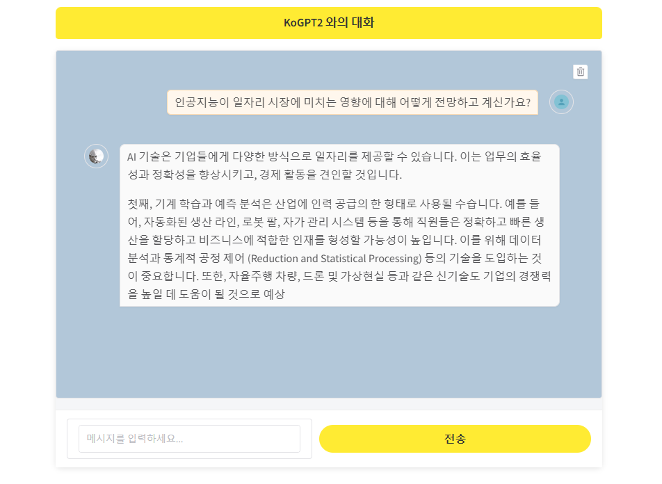

# kogpt2
- [학습 데이터](https://www.aihub.or.kr/aihubdata/data/view.do?currMenu=115&topMenu=100&aihubDataSe=data&dataSetSn=71748)
- 한국어 말뭉치 데이터 310만 건(20억 어절) Reinforcement Learning Human Feedback(RLHF) 데이터 7만 7천 건으로 구성


# 실행 방법
- cuda 버전에 맞는 torch 설치 
- requirements 설치
 ```bash
 pip install torch==2.4.1 torchvision==0.19.1 torchaudio==2.4.1 --index-url https://download.pytorch.org/whl/cu118

 pip install -r requirements.txt
 ```

# 결과
